[](https://doi.org/10.5281/zenodo.17326197)
[](https://doi.org/10.5281/zenodo.17326783)
[](LICENSE)

# LimFUNet: SE-Enhanced Ghost U-Net for Real-Time Fire Segmentation

This repository contains the official implementation of the manuscript:

**Enhancing Real-time Fire Segmentation: LimFUNet with SE-Enhanced Ghost Convolutions for Edge Computing Applications**

LimFUNet is an ultra-lightweight U-Net-inspired model for binary fire segmentation. It combines Ghost feature generation, Squeeze-and-Excitation attention, skip-connected decoding, and constant-width feature propagation to produce compact fire segmentation models suitable for resource-constrained inference.

Please cite the manuscript, code repository, and released weights if this work is useful for your research.

---

## Overview

### Model architecture

<p align="center">
  
</p>

### Proposed fire-monitoring workflow

<p align="center">
  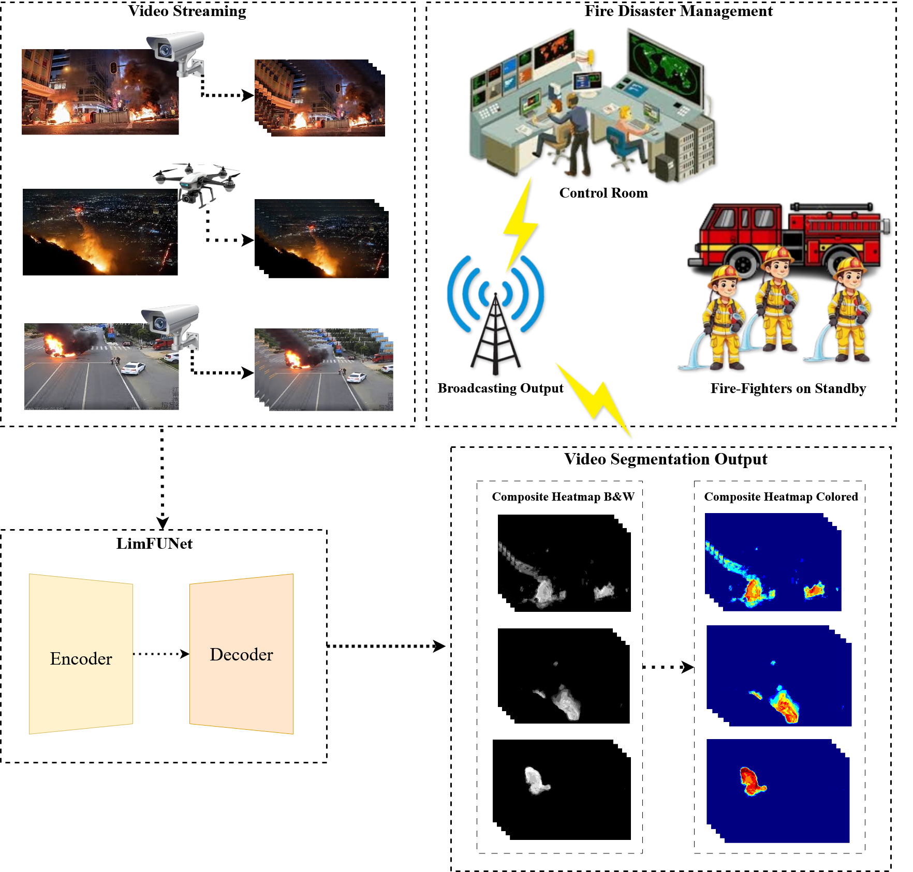
</p>

LimFUNet is designed for real-time binary fire segmentation under strict model-size and runtime constraints.

| Property | Default setting |
|---|---|
| Input size | `416 × 608` |
| Channel width | `G = 32` |
| Ghost ratio | `r = 2.0` |
| Attention module | Squeeze-and-Excitation |
| Activation | LeakyReLU |
| Parameters | `19,612` |
| Model size | approximately `0.35 MB` |
| Task | Binary fire segmentation |

---

## Repository Layout

```text
limfunet/
  keras_segmentation/
    models/
      limfunet.py       # LimFUNet encoder with SE-Ghost blocks
      unet.py           # LimFUNet decoder and final segmentation head

  train.py              # Training entry point
  benchmark.py          # Metrics, parameters, MFLOPs, MAC, and FPS evaluation
  test_single.py        # Single-image inference
  test_multiple.py      # Batch image inference
  test_video.py         # Video inference with mask and overlay output
  agg_diag.py           # Aggregation diagnostics across G variants

  trained_weights/      # Released pretrained weights
  results/              # Figures, plots, diagnostic maps, GIFs, and examples
  data/README.md        # Dataset download notes and recommended structure
````

> **Important:** the values of `G`, `GHOST_RATIO`, and the input resolution must match between the model definition, training script, inference script, and checkpoint.

---

## Installation

Clone the repository and install the required packages using either `venv` or `conda`.

### Option A: pip and venv

```bash
cd limfunet
python -m venv .venv
source .venv/bin/activate
pip install -r requirements.txt
```

### Option B: conda

```bash
cd limfunet
conda env create -f environment.yml
conda activate limfunet
```

`ffmpeg` is required for video output generation.

---

## Training

```bash
python train.py \
  --train_images "/path/to/Train/Dataset/" \
  --train_annotations "/path/to/Train_Annotation/Dataset/" \
  --validation_images "/path/to/Test/Dataset/" \
  --validation_annotations "/path/to/Test_Annotation/Dataset/" \
  --checkpoints_path "/path/to/save/checkpoint/" \
  --trained_weights "/path/to/save/checkpoint/model.h5" \
  --epochs 50 \
  --seed 0
```

The script prints the model summary, trains the model, reports end-of-epoch metrics, and saves the final weights to `--trained_weights`.

For reproducible evaluation, use the released checkpoint with the same preprocessing, input size, model configuration, and validation split used in the manuscript.

---

## Benchmarking

`benchmark.py` evaluates segmentation metrics and model efficiency indicators, including parameter count, model size, MFLOPs, and memory access cost (MAC).

Configure the model paths in the `CHECKPOINTS` dictionary, then run:

```bash
python benchmark.py
```

The benchmark output is saved as:

```text
final_benchmark.csv
```

---

## Inference

### Single image

```bash
python test_single.py \
  --weights /path/to/model.h5 \
  --inp /path/to/input.jpg \
  --out /path/to/output_mask.png \
  --height 416 --width 608
```

### Multiple images

```bash
python test_multiple.py \
  --weights /path/to/model.h5 \
  --inp_dir /path/to/images_dir \
  --out_dir /path/to/out_dir \
  --recursive \
  --height 416 --width 608
```

### Video inference

```bash
python test_video.py \
  --weights /path/to/model.h5 \
  --inp /path/to/input_video.mp4 \
  --out_overlay /path/to/output_overlay.mp4 \
  --out_mask /path/to/output_mask.mp4 \
  --height 416 --width 608 \
  --alpha 0.4
```

The video script writes a green fire-region overlay and a binary mask video. Debug frames are also saved alongside the output files.

---

## Aggregation Diagnostics

LimFUNet includes a diagnostic tool that aggregates predictions from multiple channel-width variants. This is useful for inspecting how different values of `G` respond to fire regions, boundaries, glare, and uncertain pixels.

### Image diagnostic

```bash
python agg_diag.py \
  --mode images \
  --image "/path/to/image.png" \
  --output_dir results/diag_image \
  --input_height 416 \
  --input_width 608 \
  --device gpu \
  --load_mode full \
  --model 2="/path/to/model2.h5" \
  --model 4="/path/to/model4.h5" \
  --model 8="/path/to/model8.h5" \
  --model 16="/path/to/model16.h5" \
  --model 32="/path/to/model32.h5" \
  --model 64="/path/to/model64.h5" \
  --model 128="/path/to/model128.h5" \
  --model 256="/path/to/model256.h5" \
  --overlay \
  --save_model_masks
```

### Video diagnostic

```bash
python agg_diag.py \
  --mode videos \
  --video "/path/to/video.avi" \
  --output_dir results/diag_video \
  --input_height 416 \
  --input_width 608 \
  --device gpu \
  --load_mode full \
  --model 2="/path/to/model2.h5" \
  --model 4="/path/to/model4.h5" \
  --model 8="/path/to/model8.h5" \
  --model 16="/path/to/model16.h5" \
  --model 32="/path/to/model32.h5" \
  --model 64="/path/to/model64.h5" \
  --model 128="/path/to/model128.h5" \
  --model 256="/path/to/model256.h5" \
  --overlay
```

---

## Model Internals

### Encoder

```text
limfunet/keras_segmentation/models/limfunet.py
```

Defines the SE block, Ghost block, and LimFUNet encoder.

### Decoder

```text
limfunet/keras_segmentation/models/unet.py
```

Defines the LimFUNet decoder, depthwise-pointwise upsampling blocks, and final segmentation head.

The default LimFUNet configuration uses `G = 32` and `r = 2.0`. If these values are changed, the checkpoint and architecture must be changed consistently.

---

## Pretrained Weights

Pretrained LimFUNet weights are provided in:

```text
trained_weights/
```

The released weights include mini, mid, large, and other `G`-based variants.

When benchmarking or running inference, make sure the model configuration matches the checkpoint. A checkpoint trained with one value of `G` or `r` cannot be loaded into a model built with a different configuration.


## Reproducing the Reported LimFUNet Result

The main LimFUNet result reported in the manuscript corresponds to the released checkpoint in `trained_weights/`.

To reproduce the checkpoint evaluation, use the fixed validation split and the same preprocessing settings:

- input size: 416 × 608
- channel width: G = 32
- ghost ratio: r = 2.0
- attention: SE
- activation: LeakyReLU

Training from scratch may lead to small variations because of random initialization, data ordering, augmentation, and backend nondeterminism. For exact comparison, evaluate the released checkpoint.

---

## Datasets

Please download the datasets from their official sources and respect their licenses.

### Khan et al. fire segmentation dataset

DOI: `10.1109/TITS.2022.3203868`

[Dataset link](https://drive.google.com/drive/folders/1Xfq7zLwIwJ4vPx50G-k7j2-ofh1bj3fx)

### Roboflow Fire Segmentation Dataset

[Roboflow dataset link](https://universe.roboflow.com/firesegpart1/fire-seg-part1/dataset/21)

### Foggia MIVIA Fire Detection Dataset

DOI: `10.1109/TCSVT.2015.2392531`

[MIVIA dataset link](https://mivia.unisa.it/datasets/video-analysis-datasets/fire-detection-dataset/)

### FiSmo

[Paper](https://www.researchgate.net/publication/322365857)
[GitHub](https://github.com/mtcazzolato/dsw2017)
[Example video: fireVid_017](https://drive.google.com/drive/folders/1SoYViOABT_Pt-rwrU7vPrgM7ts09D9tu?usp=sharing)

Dataset download notes and recommended folder structure are provided in:

```text
data/README.md
```

---

## Diagnostic Visualizations

### Aggregated mask and overlay

<p align="center">
  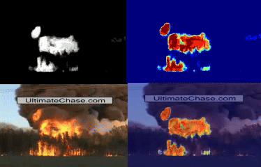
</p>

### Image-level aggregation examples

<p align="center">
  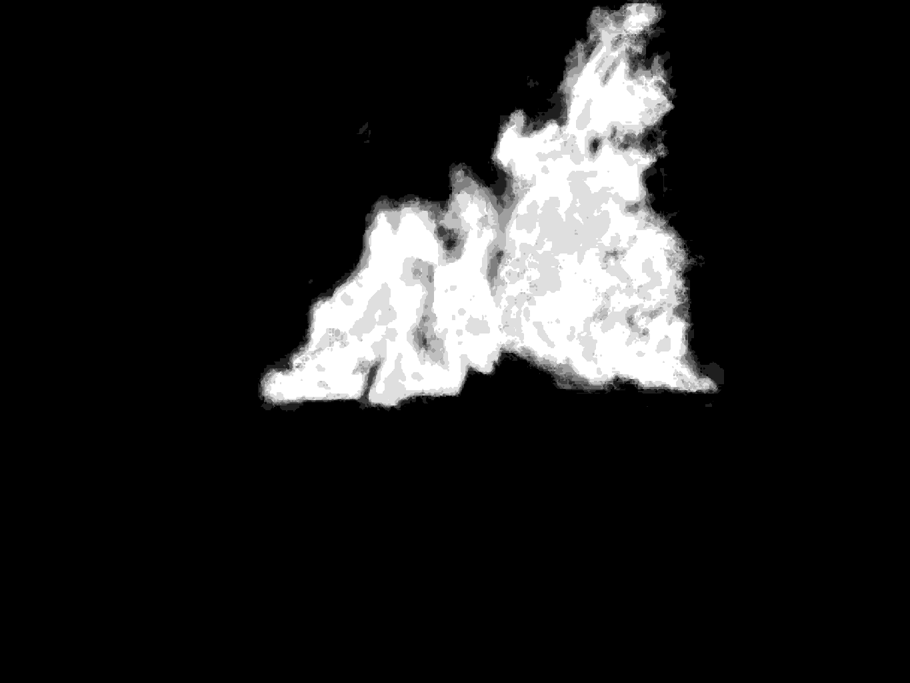
  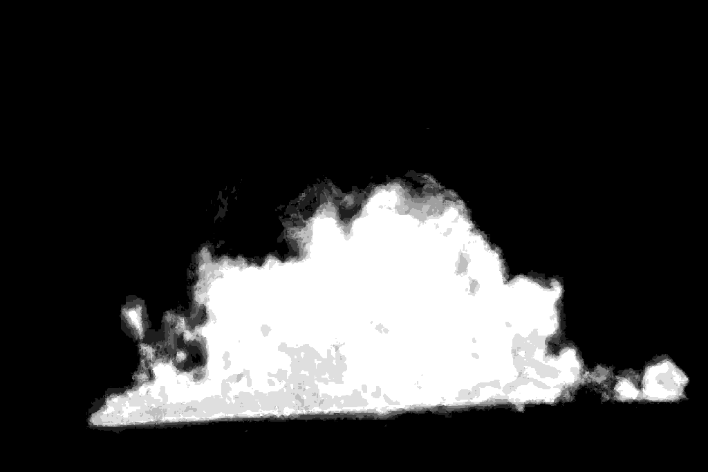
  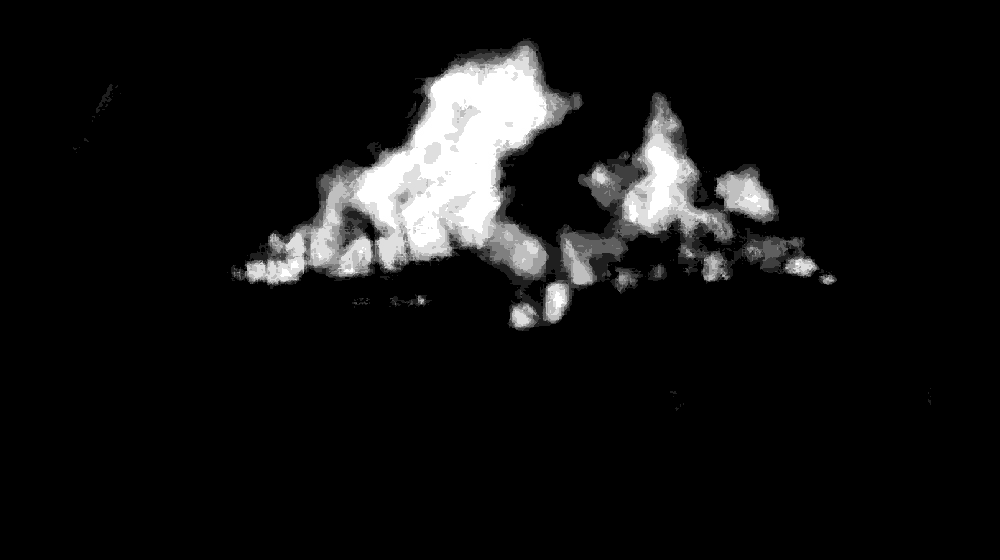
</p>

### Grayscale and colorized diagnostic maps

<p align="center">
  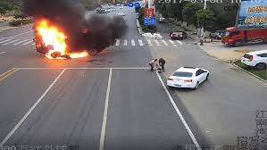
  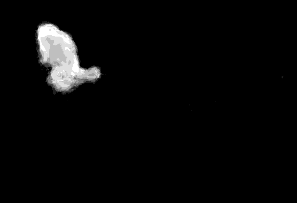
  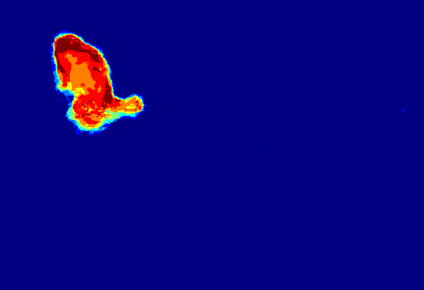
</p>

### Video-level aggregation examples

<p align="center">
  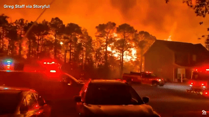
  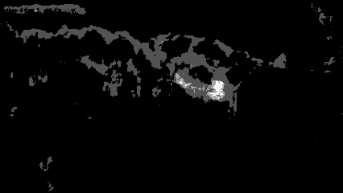
  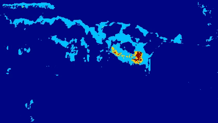
</p>

These visualizations were generated using `test_video.py` for single-model video inference and `agg_diag.py` for multi-variant aggregation diagnostics.

---

## Citation

### Manuscript

```bibtex
@article{Ugwu2025LimFUNet,
  title   = {Enhancing Real-time Fire Segmentation: LimFUNet with SE-Enhanced Ghost Convolutions for Edge Computing Applications},
  author  = {Ugwu, Emmanuel U. and Zhang, Xinming and Tesfay, Semere G. and Mehmood, Muhammad Hamza},
  journal = {The Visual Computer},
  year    = {2025}
}
```

### Code

```bibtex
@software{LimFUNet_Code,
  author    = {Ugwu, Emmanuel U. and Zhang, Xinming and Tesfay, Semere G. and Mehmood, Muhammad Hamza},
  title     = {LimFUNet: SE-Enhanced Ghost U-Net for Real-time Fire Segmentation},
  year      = {2025},
  publisher = {Zenodo},
  doi       = {10.5281/zenodo.17326197},
  url       = {https://doi.org/10.5281/zenodo.17326197}
}
```

### Pretrained weights

```bibtex
@dataset{Ugwu2025LimFUNetWeights,
  title     = {LimFUNet: Pretrained Weights},
  author    = {Ugwu, Emmanuel U.},
  year      = {2025},
  publisher = {Zenodo},
  version   = {v1.0.0},
  doi       = {10.5281/zenodo.17326783},
  url       = {https://doi.org/10.5281/zenodo.17326783},
  note      = {Pretrained LimFUNet weights for mini, mid, large, and additional channel-width variants}
}
```

---

## License

This repository is released under the [Apache-2.0 License](LICENSE).

---

## Acknowledgements

We thank the dataset providers and the open-source research community. This repository is directly associated with the manuscript submitted to *The Visual Computer*.
