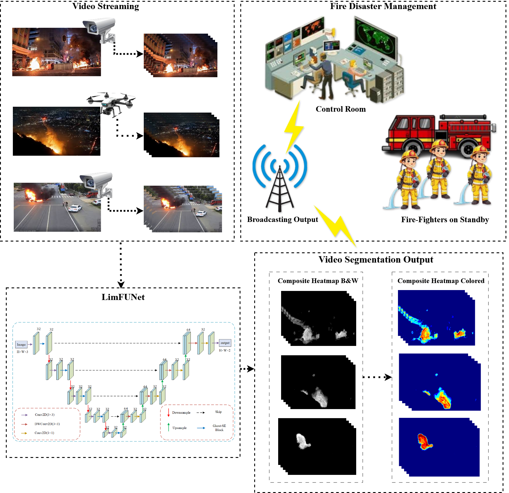
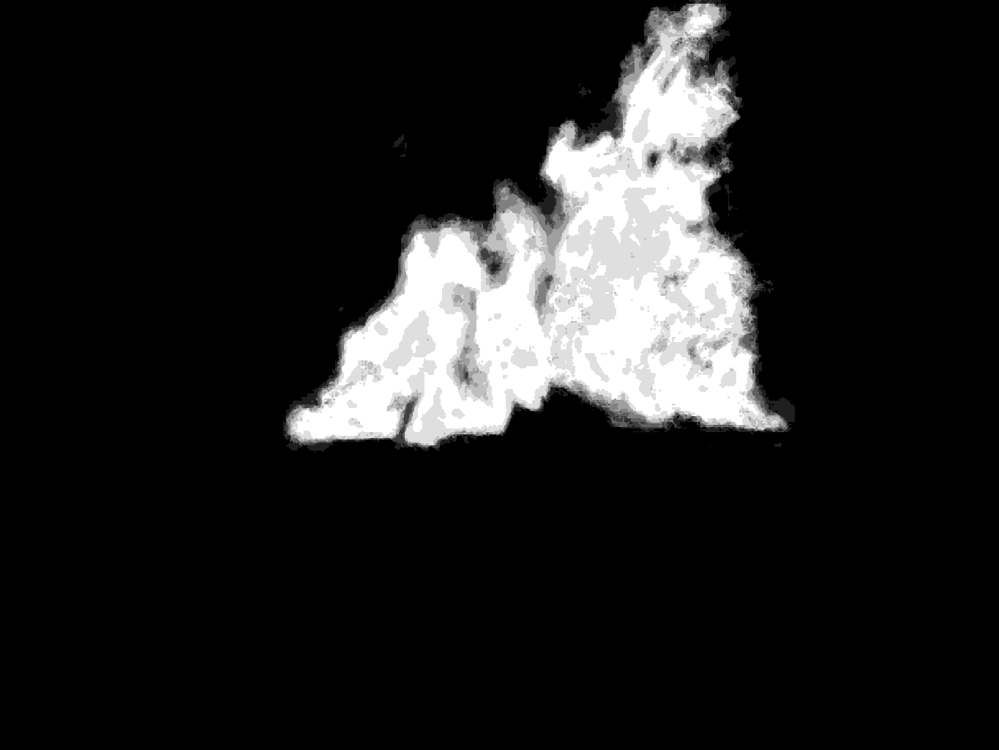

[](https://doi.org/10.5281/zenodo.17326197)
[](LICENSE)
[](https://doi.org/10.5281/zenodo.17326783)

# LimFUNet: SE-Enhanced Ghost U-Net for Real-time Fire Segmentation

> **This repository contains the official code for the manuscript:**
> *Enhancing Real-time Fire Segmentation: LimFUNet with SE-Enhanced Ghost Convolutions for Edge Computing Applications*
> **This code is directly related to the submitted manuscript. Please cite the paper and this repository.**

---

## Overview
**Model Architecture**
<p align="center">
  
</p>

**Proposed workflow**
<p align="center">
  
</p>


LimFUNet is a lightweight U-Net enhancement for binary fire segmentation. It keeps a constant channel width and combines **Ghost** convolutions with **SE** attention to achieve high mIoU with very small parameter count and real-time speed.

* Parameters: **19,612** (~0.35 MB)
* Input: **416×608**
* Attention: **SE**
* Activation: **LeakyReLU**
* Ghost ratio: **r = 2.0**
* Use case: Real-time fire segmentation on GPUs and edge devices

---

## Repository layout

```
limfunet/
  keras_segmentation/
    models/
      limfunet.py      # encoder (SE-Ghost blocks, constant G, ratio r)
      unet.py          # decoder (DWConv+PWConv up blocks, final head)
  train.py             # training entrypoint
  benchmark.py         # quantitative metrics + FLOPs + rough FPS
  test_single.py       # single-image segmentation to mask
  test_multiple.py     # batch image segmentation to masks
  test_video.py        # video overlay + mask, FFmpeg writer
  trained_weights/     # example weights: mini/mid/large (G variants)
  results/             # figures, plots, diagnostic maps, GIFs (GPU/CPU)
```

> **Important:** keep **G** and **GHOST_RATIO r** consistent between encoder (`limfunet.py`) and decoder (`unet.py`), and use the same **input height/width** everywhere.

---

## Installation
Use either of the two below to install the necessary packages.

### Option A: pip + venv

```bash
cd limfunet
python -m venv .venv && source .venv/bin/activate
pip install -r requirements.txt
```

### Option B: conda

```bash
cd limfunet
conda env create -f environment.yml
conda activate limfunet
```

## Training

Create an output folder for checkpoints and weights, then run:

```bash
python train.py \
  --train_images "/path/to/Train/Dataset/" \
  --train_annotations "/path/to/Train_Annotation/Dataset/" \
  --validation_images "/path/to/Test/Dataset/" \
  --validation_annotations "/path/to/Test_Annotation/Dataset/" \
  --checkpoints_path "/path/to/save/checkpoint/" \
  --trained_weights "/path/to/save/checkpoint/model.h5" \
  --epochs 50
```

The script prints a model summary and starts training. End-of-epoch metrics are reported. Final weights are written to `--trained_weights`.

---

## Benchmarking

`benchmark.py` evaluates accuracy metrics, counts params, estimates MFLOPs, and computes a **rough** per-image FPS (use only as a coarse indicator).

Configure the checkpoints in the `CHECKPOINTS` dict and run:

```bash
python benchmark.py
```

A CSV called `final_benchmark.csv` is written. **Ignore the FPS if you need precise real-time throughput**; it is a quick estimate.

---

## Inference

### Single image → mask

```bash
python test_single.py \
  --weights /path/to/model.h5 \
  --inp /path/to/input.jpg \
  --out /path/to/output_mask.png \
  --height 416 --width 608
```

### Multiple images → masks

```bash
python test_multiple.py \
  --weights /path/to/model.h5 \
  --inp_dir /path/to/images_dir \
  --out_dir /path/to/out_dir \
  --recursive \
  --height 416 --width 608
```

### Video → green overlay + BW mask (FFmpeg)

```bash
python test_video.py \
  --weights /path/to/model.h5 \
  --inp /path/to/input_video.mp4 \
  --out_overlay /path/to/output_overlay.mp4 \
  --out_mask /path/to/output_mask.mp4 \
  --height 416 --width 608 \
  --alpha 0.4
```

First frames are saved as debug PNGs alongside outputs. Requires `ffmpeg` in `PATH`.

---

## Model internals (where to look)

* **Encoder:** `limfunet/keras_segmentation/models/limfunet.py`
  Defines `se_block`, `ghost_block`, and `limfunet_encoder(...)`.
  Keep `G` and `GHOST_RATIO` fixed across the network.

* **Decoder:** `limfunet/keras_segmentation/models/unet.py`
  Defines `limfunet_decoder(...)` and `limfunet(...)` using depthwise + pointwise up blocks and the final `Conv2D` head.

---

## Pretrained weights

* Mini / Mid / Large variants (and other variants ( other `G`)): [`trained_weights/`](trained_weights/)

> Note: when benchmarking multiple models together, architectures must match. If `G` or `r` differ, run separate benchmarks or modify the script accordingly.

---

## Datasets

Please obtain datasets from their official sources and respect licenses:

* **Khan et al.** DOI: 10.1109/TITS.2022.3203868
  Link: [https://drive.google.com/drive/folders/1Xfq7zLwIwJ4vPx50G-k7j2-ofh1bj3fx](https://drive.google.com/drive/folders/1Xfq7zLwIwJ4vPx50G-k7j2-ofh1bj3fx)

* **Roboflow Fire Segmentation**
  [https://universe.roboflow.com/firesegpart1/fire-seg-part1/dataset/21](https://universe.roboflow.com/firesegpart1/fire-seg-part1/dataset/21)

* **Foggia (MIVIA) Fire dataset** DOI: 10.1109/TCSVT.2015.2392531
  [https://mivia.unisa.it/datasets/video-analysis-datasets/fire-detection-dataset/](https://mivia.unisa.it/datasets/video-analysis-datasets/fire-detection-dataset/)

* **BurnedAreaUAV (BAUAV)** DOI: [https://doi.org/10.1016/j.isprsjprs.2023.07.002](https://doi.org/10.1016/j.isprsjprs.2023.07.002)
  [https://zenodo.org/records/7944963](https://zenodo.org/records/7944963)

* **FiSmo** paper and sources
  Paper: [https://www.researchgate.net/publication/322365857](https://www.researchgate.net/publication/322365857)
  GitHub: [https://github.com/mtcazzolato/dsw2017](https://github.com/mtcazzolato/dsw2017)
  Example video (fireVid_017): [https://drive.google.com/drive/folders/1SoYViOABT_Pt-rwrU7vPrgM7ts09D9tu?usp=sharing](https://drive.google.com/drive/folders/1SoYViOABT_Pt-rwrU7vPrgM7ts09D9tu?usp=sharing)

We provide **download scripts** and recommended directory structure in [`data/README.md`](data/README.md).

---

## Results Summary

We report strong efficiency–accuracy trade-offs on all evaluated datasets with **G = 32**, **r = 2.0**, and **SE enabled**, using input resolution **416 × 608**.  
Full metric tables and qualitative comparisons are included in the manuscript and in the [`results/`](results/) directory.

**Results on 5 Foggia videos**
<table> <thead> <tr> <th>Model</th> <th>MFLOPs / Image</th> <th>fire01</th> <th>fire03</th> <th>fire04</th> <th>fire08</th> <th>fire13</th> <th>Avg FPS</th> </tr> </thead> <tbody> <tr> <td><strong>LimFUNet</strong></td> <td><strong>3,243.46</strong></td> <td><strong>23.46</strong></td> <td><strong>25.88</strong></td> <td><strong>24.88</strong></td> <td><strong>24.77</strong></td> <td><strong>21.92</strong></td> <td><strong>24.18</strong></td> </tr> <tr> <td>MobileNetV2</td> <td>5,140.91</td> <td><u>19.88</u></td> <td><u>19.04</u></td> <td><u>20.37</u></td> <td><u>21.63</u></td> <td><u>19.20</u></td> <td><u>20.02</u></td> </tr> <tr> <td>MobileNetV3</td> <td><u>4,693.91</u></td> <td>16.82</td> <td>18.65</td> <td>16.84</td> <td>18.24</td> <td>17.29</td> <td>17.57</td> </tr> <tr> <td>LinkNet</td> <td>8,809.26</td> <td>11.05</td> <td>11.56</td> <td>10.75</td> <td>11.04</td> <td>10.33</td> <td>10.95</td> </tr> <tr> <td>FPN</td> <td><em>102,205.71</em></td> <td><em>8.19</em></td> <td><em>8.16</em></td> <td><em>8.54</em></td> <td><em>8.44</em></td> <td><em>8.49</em></td> <td><em>8.36</em></td> </tr> </tbody> </table>

---

## Diagnostic Visualizations

- **Variant aggregation map:** Scripts and examples under [`results/`](results/) aggregate predictions from multiple `G` variants into a unified interpretive heatmap for each input.
- **GPU vs CPU GIFs:** Example GIFs showing real-time inference and measured FPS are located in [`results/`](results/).  
  These visualizations were generated using `test_video.py`, `test_video.py`, and `test_video.py` (For Black and white / colored mask of a single variant) or `agg_img_variants.py`, and `agg_vid_variants.py` (For black and white mask / colored mask, aggregated from multiple variants).


**Visualizations**
GPU B&W mask vs GPU overlay (GIFs)
<p align="center">   </p>

**Diagnostic aggregation**

We also show the composite heatmap from aggregating predictions across all G variants (G=2…256) and its video version.

<!-- Row 1 -->
<p align="center">
  
  
  
</p>

<!-- Row 2 -->
<p align="center">
  
  
  
</p>

<!-- Row 2 -->
<p align="center">
  
  
  
</p>


---

## 🧩 Reproducibility Checklist

* [x] **Code availability:** Full training, inference, and benchmarking scripts provided in this repository (`train.py`, `benchmark.py`, `test_*`).
* [x] **Model weights:** Pretrained LimFUNet variants released on Zenodo ([DOI link](https://zenodo.org/records/17326783)).
* [x] **Environment:** Reproducible via `requirements.txt` and `environment.yml`.
* [x] **Random seeds:** TensorFlow and NumPy seeds fixed where relevant.
* [x] **Data splits:** Follow the structure in `data/` (`images_prepped_train`, `annotations_prepped_train`, etc.).
* [x] **Hardware details:** Experiments conducted on NVIDIA GeForce RTX 4090 (CUDA 11.2, cuDNN 8.1).
* [x] **Evaluation:** Benchmark and metrics computed via `keras_segmentation.predict.evaluate`.
* [x] **Visualization:** Diagnostic and performance visualizations.
* [x] **Citation:** Please cite using the repository’s `CITATION.cff` or BibTeX entry.

---

## How to cite

**Manuscript:**

```
@article{Ugwu2025LimFUNet,
  title={Enhancing Real-time Fire Segmentation: LimFUNet with SE-Enhanced Ghost Convolutions for Edge Computing Applications},
  author={Ugwu, Emmanuel U. and Zhang, Xinming and Tesfay, Semere G. and Mehmood, Muhammad Hamza},
  journal={The Visual Computer},
  year={2025}
}
```

**Code (for this repo):**

```
@software{LimFUNet_Code,
  author       = {Ugwu, Emmanuel U. and Zhang, Xinming and Tesfay, Semere G. and Mehmood, Muhammad Hamza},
  title        = {LimFUNet: SE-Enhanced Ghost U-Net for Real-time Fire Segmentation},
  year         = {2025},
  publisher    = {Zenodo},
  doi          = {10.5281/zenodo.17326197},
  url          = {https://doi.org/10.5281/zenodo.17326197}
}
```

**weights:**

```
@dataset{ugwu2025_limfunet_weights,
  title        = {LimFUNet: Pretrained Weights},
  author       = {Ugwu, Emmanuel U.},
  year         = {2025},
  publisher    = {Zenodo},
  version      = {v1.0.0},
  doi          = {10.5281/zenodo.17326783},
  url          = {https://doi.org/10.5281/zenodo.17326783},
  note         = {Contains pretrained LimFUNet weights (mini, mid, and large variants) 
                corresponding to the architectures described in the LimFUNet repository.}
}


```

---

## License

This work is released under **Apache-2.0** [LICENSE](LICENSE).

---

## Acknowledgements

We thank the dataset providers and the open-source community. This repository is directly related to the manuscript submitted to *The Visual Computer*.
